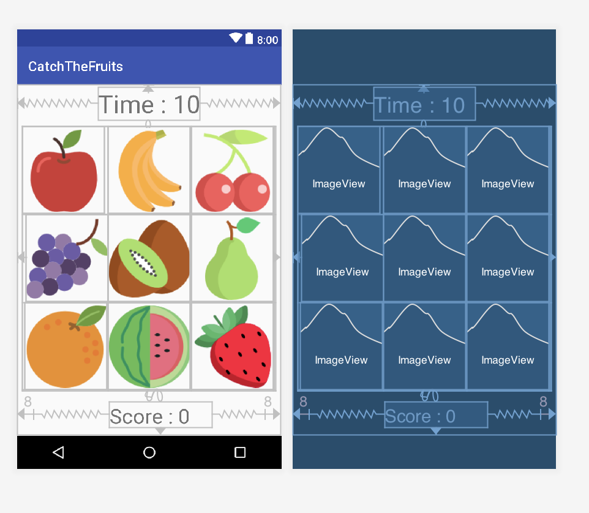

## Gameplay of the Project 👻

There are 9 different fruit pictures in the application. 1 random one changes every half second. other 8
The fruit is hidden until the game is over. Play time is 10 seconds. How much fruit can you catch during this time?
It is an application that measures its measurement and the strength of your reflexes.


## Content of the Project 📖

The following structures and components were used in the project: <br>

- Data Binding
- Alert Dialog
- Timers
- Runnable & Handler
- Grid Layout
- Constraint Layout
- TextView
- ImageView


## Screen Design of the Project 📱



The project is designed as a single screen for now. The outermost Constraint Layout and the inside Grid Layout have been added. Grid Layout
9 Image Views were used in it. One text view at the top to keep the time and another to show the score below
A text view is used.

## Using Runnable, Handler and Timer ⏱

**Runnable** : The operations to be done within the run method are specified.

**Handler & Timer** : It allows us to direct the events that we want to be repeated at certain intervals and to use them.
structures that enable us to manage.

In our project, counting backwards from 10 to 0 is performed. Therefore, the above structures were used.

```kotlin 
    var handler: Handler = Handler()

    var runnable: Runnable = Runnable { }
```
Object definitions are made.

```kotlin 
        object : CountDownTimer(10000, 1000) {

            override fun onFinish() { 

                tvTime.text = "Time's up!" 
                handler.removeCallbacks(runnable)


                for (image in imageArray) { 

                    image.visibility = View.INVISIBLE 
                }
          
            }

            override fun onTick(p0: Long) { 

                tvTime.text = "Time : " + p0 / 1000 
            }

        }.start()
```

There is a class that counts backwards from 10. If the class has 2, the method should be added.
These are the following methods. If these methods are not added, it will warn you and ask you to add the methods.

  - _onFinish_ : This method is a function that includes what to do after the operation about the Timer is completed.
In our example, when the time is up, we print a message to the text and make the visible fruits on the screen invisible.
so that he does not click on the fruits and increase the score. By deleting future calls, we finish our game.

  - _onTick_ : It is the method that specifies what will be done in each second. Update seconds every second
process is done and written in the text part.


## How to Hide Pictures and Randomly Show them 🖼

Generate 9 random numbers with the help of the Random class and use them in the function below.
we show a random image every half second. It has a structure that repeats these processes continuously.
We do it with the help of runnable and handler.

```kotlin
// method to hide pictures
fun hideImages() {
    runnable = Runnable {
        for (image in imageArray) {

            image.visibility = View.INVISIBLE
        }

        val random = Random()
        val index = random.nextInt(8 - 0)
        imageArray[index].visibility = View.VISIBLE

        handler.postDelayed(runnable, 500)
    }
    handler.post(runnable)
}
```


## Score Increase Process when Clicking on Pictures 📸

The user gets points by clicking the pictures on the screen. How does the user do this?
If you're curious, let's examine the method below ;)

```kotlin
// Function that increases points when clicking pictures

fun increaseScore(view: View) {

    score++

    tvScore.text = "Score : $score" // score value is displayed on the screen.

}
```

Each time the user clicks, the score variable is incremented once and updates the score value on the screen.
